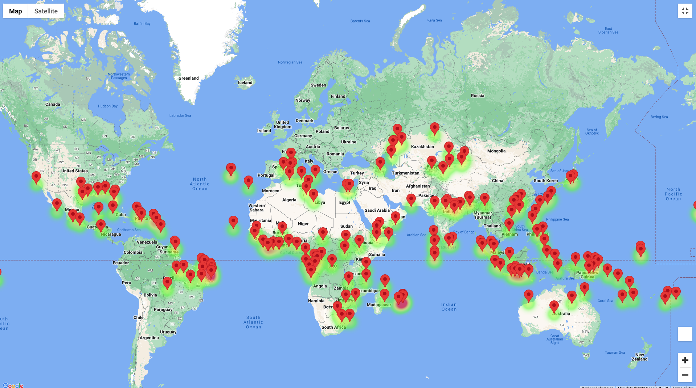
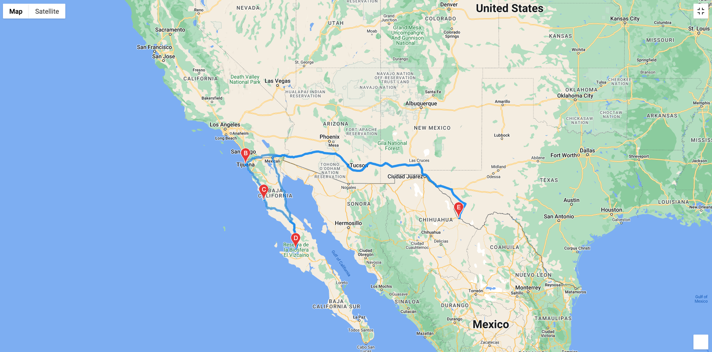
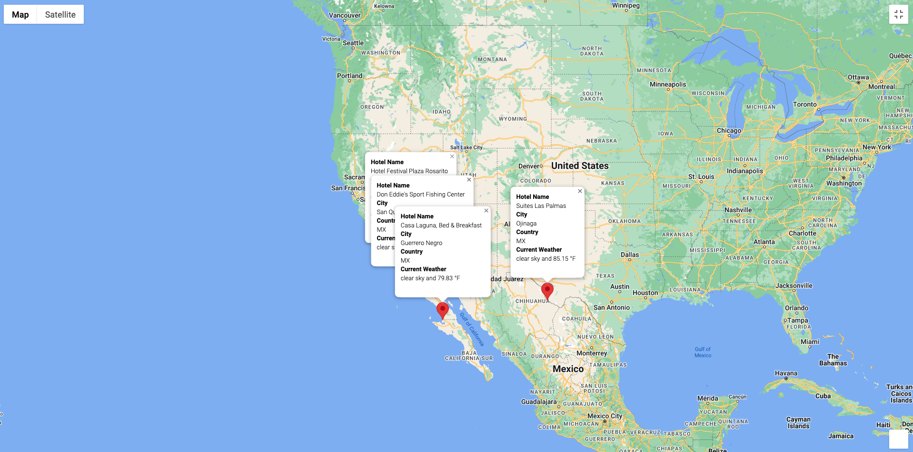

# World Weather Analysis
## Project Overview
PLANMYTRIP is a company specializing in the hotel and lodging business. The World Weather Analysis project was designed to provide clients with their ideal hotel anywhere in the world based on their preferences, such as *ideal weather*. 

## Results
I created several heatmaps showing cities based on the client's temperature preferences. I also created a layer to show on the map markers for each city displaying the following: City name, country code, maximum temperature and a hotel nearby. 

## Challenge
The  PlanMyTrip app was well received by the company.  They asked to add some other features to this app, such as current temperature  in degrees to the weather description and the possibility for the user to create a vacation itinerary. 

The app was a success, and the tester was able to create an itinerary with temperature preferences and travel mode. The first image shows the itinerary and the last image shows a marker for each city in the itinerary.  

